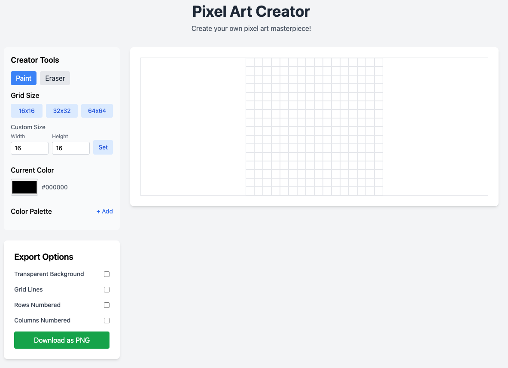

# Pixel Art Creator

A simple, interactive web application for creating pixel art with a variety of tools and export options.

## Features

- 🎨 Create pixel art with a customizable grid (16x16, 32x32, 64x64, or custom sizes up to 100x100)
- 🖌️ Paint with a color picker and custom color palette
- ✏️ Switch between paint and eraser tools
- 🎨 Save custom colors to your palette
- 📥 Export your artwork as PNG with various options:
  - Transparent background
  - Grid lines
  - Row and column numbering
- 🎯 Responsive design that works on desktop and tablet

## Getting Started

### Prerequisites

- A modern web browser (Chrome, Firefox, Safari, Edge)
- No installation required - runs directly in the browser

### Usage

1. Open `index.html` in your web browser
2. Choose a grid size or create a custom size
3. Select a color from the palette or use the color picker
4. Click on the grid to paint pixels
5. Use the eraser tool to remove colors
6. Export your artwork when finished

## Tools

### Creator Tools
- **Paint**: Default tool for coloring pixels
- **Eraser**: Remove colors from pixels
- **Grid Size**: Choose from presets or set custom dimensions
- **Color Picker**: Select any color for your palette
- **Color Palette**: Save and access your favorite colors

### Export Options
- **Transparent Background**: Export with or without a background
- **Grid Lines**: Include grid lines in the exported image
- **Rows/Columns Numbered**: Add numbering to rows and columns

## Keyboard Shortcuts

- **Left Click**: Paint with selected color
- **Right Click**: Erase (when using the eraser tool)
- **Hold Click + Drag**: Paint/erase multiple pixels

## Browser Compatibility

This application works best in modern browsers that support:
- HTML5 Canvas
- CSS Grid
- JavaScript ES6+

## Contributing

Contributions are welcome! Please feel free to submit a Pull Request.

## License

This project is open source and available under the [MIT License](LICENSE).

## Author

- [Your Name](https://github.com/yourusername)

---

Created with ❤️ for pixel art enthusiasts
